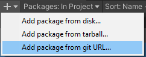

Installation:

Dans la fenêtre de Package Manager (Window → Package Manager), cliquez sur "Add package from git URL..." et entrez le lien du dépot ( https://github.com/RemyUnity/sg-node-library ) et cliquez sur "Add"

