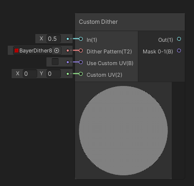
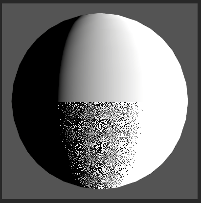

Custom Dither

Génère un motif de tramage depuis une valeur d'entrée.

|  |
| ------------------------------------------------- |
| haut: valeur d'entrée, bas: motif de tramage      |

Entrées

| In             | Valeur d'entrée                                              |
| -------------- | ------------------------------------------------------------ |
| Dither Pattern | Texture de tramage (canal rouge)                             |
| Use Custom UV  | Utiliser ou non des coordonées UV personalisées pour appliquer le tramage (coordonées par défaut : screen space) |
| Custom UV      | Coordonées de tramage personalisées                          |

