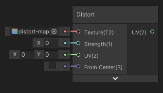

Distord

Déforme les UV en entrée avec une texture de distortion et une valeur d'intensité.

|  |  |  |
| ------------------------- | ------------------------- | ------------------------- |
| Sans distortion           | Intensitée = 0.1          | From Center activé        |

Entrées

|             |                                                     |
| ----------- | --------------------------------------------------- |
| Texture     | *Texture Object*: Texture de distortion (RG)        |
| Strength    | *Float*: Intensité de distortion                    |
| UV          | *Vector2*: Coordonées UV à déformer                 |
| From Center | *Bool*: Déformer depuis le centre (0.5, 0.5) des UV |

