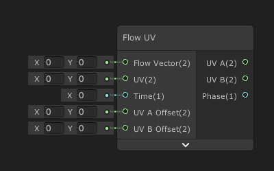
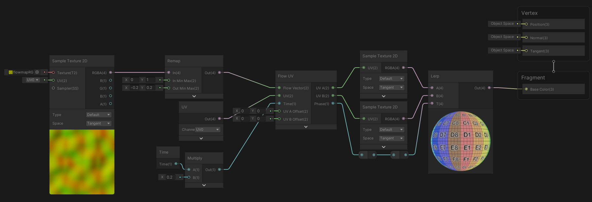
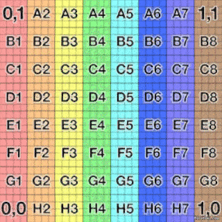

Flow UV

Génère une paire de coordonées UV déformés a partir de coordonées de base et d'un vecteur de flux, ainsi qu'une valeur de phase de transition.

|  |
| ------------------------ |
| Exemple d'utilisation    |

|  |
| ----------------------- |
| Résultat                |

Entrées

|             |                                                   |
| ----------- | ------------------------------------------------- |
| Flow Vector | *Vector2*: Vecteur de flux (direction)            |
| UV          | *Vector2*: Coordonées UV d'origine                |
| Time        | *Float*: Temps                                    |
| UV A Offset | *Vector2*: Décalage des coordonées en sortie UV A |
| UV B Offset | *Vector2*: Décalage des coordonées en sortie UV B |

Sorties

|       |                                                              |
| ----- | ------------------------------------------------------------ |
| UV A  | *Vector2*: Coordonées UV de début de phase                   |
| UV B  | *Vector2*: Coordonées UV de fin de phase                     |
| Phase | *Float*: Valeur de phase utilisé pour la transition des coordonées UV |

