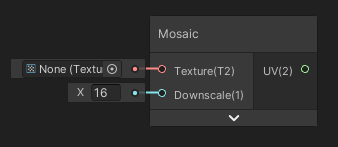
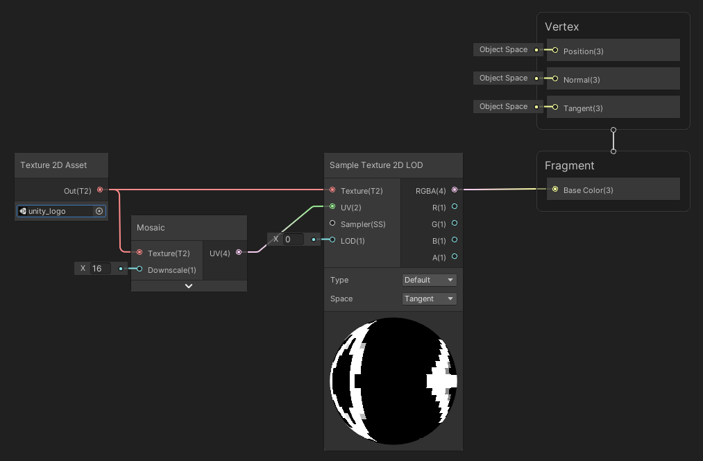
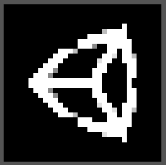

Mosaic

Génère des coordonnées UV permettant d'échantillonner un texture avec un effet de mosaïque.

|  |
| ------------------------ |
| Exemple d'utilisation    |

|  |
| ------------------------ |
| Résultat                 |

Entrées

|           |                                                              |
| --------- | ------------------------------------------------------------ |
| Texture   | *Texture 2D Asset*: Texture de référence pour les dimensions (en pixel) de base |
| Downscale | *Float*: Coefficient de rétrécicement                        |

Sorties

|      |                                     |
| ---- | ----------------------------------- |
| UV   | *Vector 2*: Coordonées UV de sortie |

