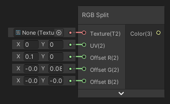
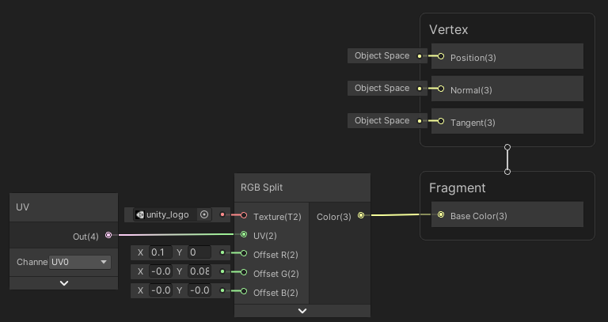
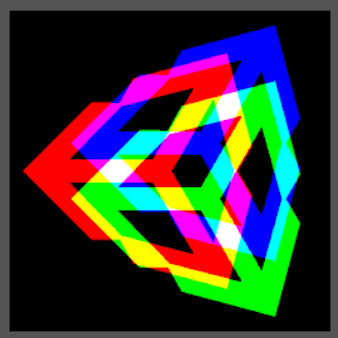

RGB Split

Échantillonne une texture avec un effet de décalage sur les trois canaux de couleur (Rouge, Vert et Bleu).

|  |
| --------------------------- |
| Exemple d'utilisation       |

|  |
| --------------------------- |
| Résultat                    |

Entrées

|          |                                             |
| -------- | ------------------------------------------- |
| Texture  | *Texture 2D Asset*: Texture a échantilloner |
| UV       | *Vector 2*: Coordonées UV de base           |
| Offset R | *Vector 2*: Décalage UV du canal rouge      |
| Offset G | *Vector 2*: Décalage UV du canal vert       |
| Offset B | *Vector 2*: Décalage UV du canal bleu       |

Sorties

|       |                               |
| ----- | ----------------------------- |
| Color | *Vector 3*: Couleur de sortie |

