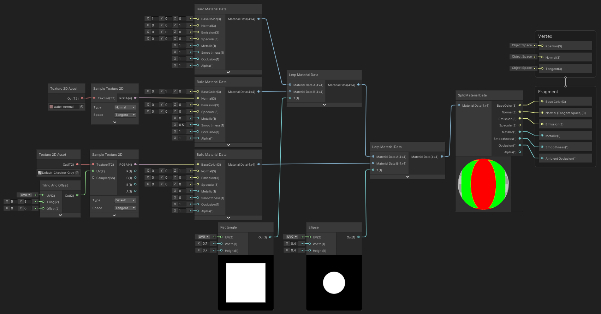
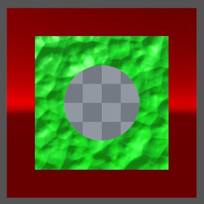

Build Material Data

Stocke les données de surface d'un matériel dans une connexion unique.

|              |
| ---------------------------------------------- |
| Exemple de flux d'utilisation du material data |

|  |
| ----------------------------------------- |
| Résultat                                  |

Entrées

|            |                                      |
| ---------- | ------------------------------------ |
| BaseColor  | *Vector 3*: Couleur de base (Albedo) |
| Normal     | *Vector 3*: Normale                  |
| Emission   | *Vector 3*: Couleur d'émission       |
| Specular   | *Vector 3*: Couleur spéculaire       |
| Metallic   | *Float*: Valeur de métalléité [0;1]  |
| Smoothness | *Float*: Valeur de régularité [0;1]  |
| Occlusion  | *Float*: Valeur d'occlusion [0;1]    |
| Alpha      | *Float*: Valeur d'alpha [0;1]        |

Sorties

|               |                                                              |
| ------------- | ------------------------------------------------------------ |
| Material Data | *Matrix 4x4*: Connexion unique contenant toutes les informations en entrée |

