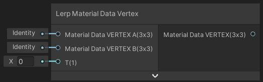
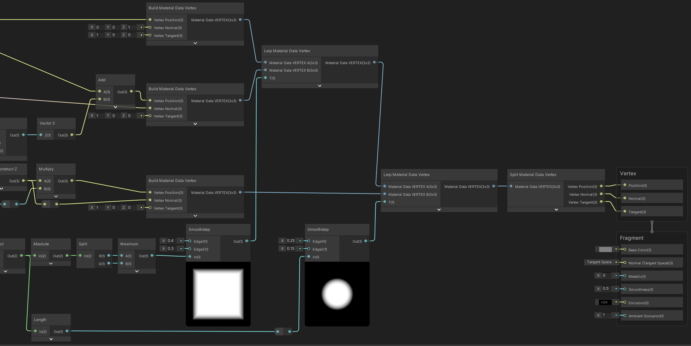
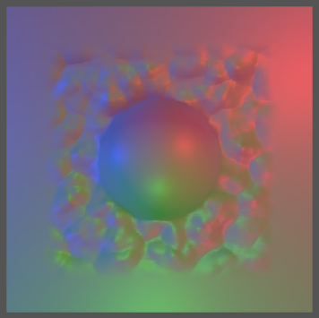

Lerp Material Data

Interpolation linéaire de deux données de sommets de maillage de matériel (Material Data VERTEX A et B) en fonction d'une intensité (T).

|       |
| ---------------------------------------------- |
| Exemple de flux d'utilisation du material data |

|  |
| ------------------------------------------------ |
| Résultat                                         |

Entrées

|                        |                                                            |
| ---------------------- | ---------------------------------------------------------- |
| Material Data VERTEX A | *Matrix 3x3*: Données de sommets de maillage de matériel A |
| Material Data VERTEX B | *Matrix 3x3*: Données de sommets de maillage de matériel B |
| T                      | *Float*: Facteur d'interpolation [0;1]                     |

Sorties

|               |                                                              |
| ------------- | ------------------------------------------------------------ |
| Material Data | *Matrix 3x3: Données de sommets de maillage de matériel interpolé |

