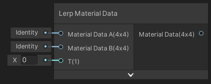
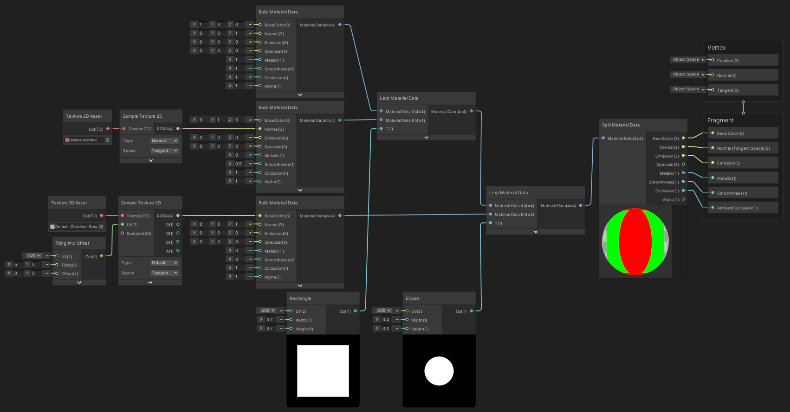

Lerp Material Data

Interpolation linéaire de deux données de matériel (Material Data A et B) en fonction d'une intensité (T).

|              |
| ---------------------------------------------- |
| Exemple de flux d'utilisation du material data |

|  |
| ----------------------------------------- |
| Résultat                                  |

Entrées

|                 |                                        |
| --------------- | -------------------------------------- |
| Material Data A | *Matrix 4x4*: Données de matériel A    |
| Material Data B | *Matrix 4x4*: Données de matériel B    |
| T               | *Float*: Facteur d'interpolation [0;1] |

Sorties

|               |                                             |
| ------------- | ------------------------------------------- |
| Material Data | *Matrix 4x4*: Données de matériel interpolé |

