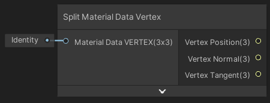

Split Material Data Vertex

Décompose les données des sommets de maillage d'un matériel depuis un connexion unique.

|       |
| ---------------------------------------------- |
| Exemple de flux d'utilisation du material data |

|  |
| ------------------------------------------------ |
| Résultat                                         |

Entrées

|                      |                                                              |
| -------------------- | ------------------------------------------------------------ |
| Material Data VERTEX | *Matrix 3x3*: Connexion unique contenant toutes les informations des sommets de maillage |

Sorties

|                 |                      |
| --------------- | -------------------- |
| Vertex Position | *Vector 3*: Position |
| Vertex Normal   | *Vector 3*: Normale  |
| Vertex Tangent  | *Vector 3*: Tangente |

